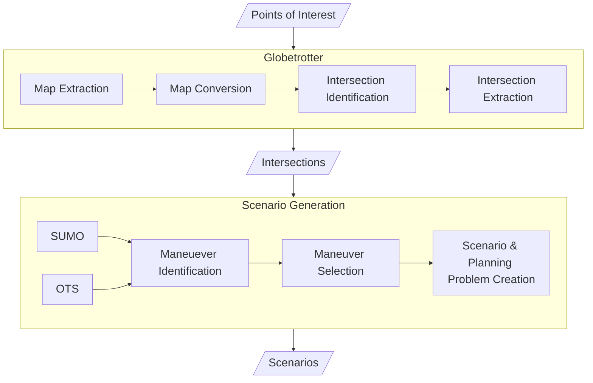

# Scenario Generation Pipeline

```mermaid
%%{init: { "themeVariables": { "fontSize": "25px" } } }%%
flowchart TB

poi@{shape: lean-r, label: "Points of Interest"} --> g
subgraph g ["Globetrotter"]
  direction LR
  g1["Map Extraction"] --> g2["Map Conversion"]
  g2 --> g3["Intersection Identification"]
  g3 --> g4["Intersection Extraction"]
end
g --> intersections@{shape: lean-r, label: "Intersections"} --> sg
subgraph sg ["Scenario Generation"]
  direction LR
  s1["SUMO"] --> sg1
  s2["OTS"] --> sg1
  sg1["Maneuever Identification"] --> sg2["Maneuver Selection"]
  sg2 --> sg3["Scenario & Planning Problem Creation"]
end
sg --> scenarios@{shape: lean-r, label: "Scenarios"}
```
